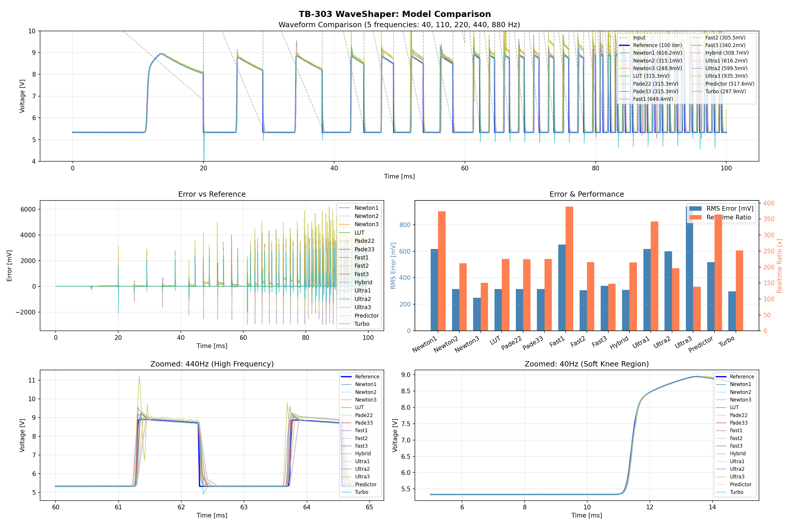

# TB-303 WaveShaper 実装評価

## 概要

TB-303の波形整形回路をEbers-Moll BJTモデルでシミュレーション。
Newton-Raphson法にSchur補完（j22ピボット）を適用した反復ソルバー。

**基本原理**: あらゆる箇所を近似計算に置き換えてもニュートン反復を十分に行えば補正される

## テスト条件

- サンプルレート: 48kHz
- テスト周波数: 40, 110, 220, 440, 880 Hz
- リファレンス: WaveShaperReference (100回反復, std::exp)
- ベンチマーク: 1秒分のオーディオ処理（3回平均）

## 実装一覧と評価

### Tier 1: 推奨 (★4-5)

| モデル | 反復数 | RMS誤差 | 速度 | 評価 | 用途 |
|--------|--------|---------|------|------|------|
| **Turbo** | 2 | 298mV | 252x | ★4.5 | 最良バランス。2回目でE-B計算を再利用 |
| Newton2 | 2 | 315mV | 211x | ★4 | 標準的な高品質実装 |
| LUT | 2 | 315mV | 226x | ★4 | exp()をLUTで近似 |
| Pade22 | 2 | 315mV | 224x | ★4 | exp()をPade[2,2]近似 |
| Pade33 | 2 | 315mV | 225x | ★4 | exp()をPade[3,3]近似 |
| Fast2 | 2 | 305mV | 215x | ★4 | 緩和ダンピング適用 |
| Hybrid | 2 | 309mV | 214x | ★4 | 1回目Fast + 2回目Full |

### Tier 2: 用途限定 (★3-3.5)

| モデル | 反復数 | RMS誤差 | 速度 | 評価 | 用途 |
|--------|--------|---------|------|------|------|
| Newton3 | 3 | 249mV | 150x | ★3.5 | 最高精度が必要な場合 |
| Predictor | 1 | 518mV | 365x | ★3.5 | 予測子+1回補正、高速優先 |
| Newton1 | 1 | 616mV | 374x | ★3 | 極端な速度優先 |
| Fast1 | 1 | 649mV | 389x | ★3 | 最高速、品質妥協 |
| Fast3 | 3 | 340mV | 148x | ★3 | 3回反復でも精度改善限定的 |

### Tier 3: 非推奨 (★2以下)

| モデル | 反復数 | RMS誤差 | 速度 | 評価 | 理由 |
|--------|--------|---------|------|------|------|
| Ultra1 | 1 | 616mV | 342x | ★2 | B-Cキャッシュ前提が破綻 |
| Ultra2 | 2 | 600mV | 196x | ★2 | 遅い上に精度も悪い |
| Ultra3 | 3 | 935mV | 139x | ★1 | 反復増で逆に精度悪化 |

## JacobianMode解説

```cpp
enum class JacobianMode { Full, Fast, Hybrid, Ultra, Predictor, Turbo };
```

| Mode | 特徴 |
|------|------|
| Full | 毎回フルヤコビアン計算 |
| Fast | 緩和ダンピング適用（収束安定化） |
| Hybrid | 1回目Fast、2回目以降Full |
| Ultra | B-C接合電流を前サンプルから推定（失敗） |
| Predictor | 線形予測で初期値推定 + 1回補正 |
| Turbo | 2回反復、2回目でE-B計算結果を再利用 |

## exp()近似比較

| 実装 | 手法 | 精度影響 | 速度 |
|------|------|----------|------|
| StdExp | std::exp | 基準 | 最遅 |
| FastExp | Schraudolph | 微小 | 最速 |
| LUT | 1024点テーブル補間 | 微小 | 中 |
| Pade22 | Pade[2,2]有理近似 | 微小 | 中 |
| Pade33 | Pade[3,3]有理近似 | 微小 | 中 |

→ **結論**: exp()近似による精度劣化は反復で補正され、実質無視できる

## 推奨選択ガイド

```
リアルタイム処理 → Turbo (★4.5)
  ├─ 速度重視 → Predictor (★3.5)
  └─ 品質重視 → Newton3 (★3.5)

オフライン処理 → Newton3 (★3.5) または Reference (100回)
```

## ベンチマーク結果グラフ



## 技術詳細

### Schur補完によるソルバー

2x2システムを1x1に縮約:
```
[j11 j12] [dx1]   [f1]
[j21 j22] [dx2] = [f2]

→ dx2 = (f2 - j21/j11 * f1) / (j22 - j21*j12/j11)
→ dx1 = (f1 - j12*dx2) / j11
```

### Turbo最適化

```cpp
// 1回目: 通常計算
auto [v_eb1, exp_eb1, ...] = schur_step<DiodeIV>(v_in, v_a, v_b, c);

// 2回目: E-B計算を再利用（v_aは大きく変化しない前提）
auto [v_eb2, _, ...] = schur_step_reuse_eb<DiodeIV>(v_in, v_a, v_b, c, v_eb1, exp_eb1);
```

---
*Generated: 2026-01-28*
*Test: compare_all_models.py*
